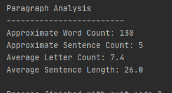

# PyParagraph
## Text Analysis

Create a Python script to automate the analysis of any such passage using these metrics. Your script will need to do the following:

Import a text file filled with a paragraph.

* Assess the passage for each of the following:

* Approximate word count

* Approximate sentence count

* Approximate letter count (per word)

* Average sentence length (in words

Output

